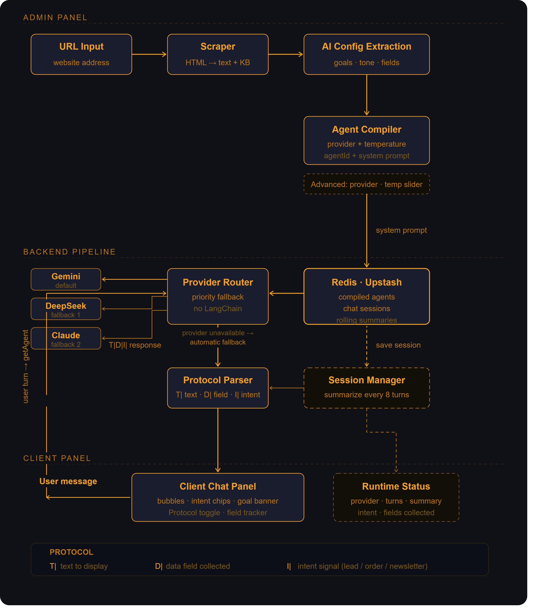

# AI Orchestration Middleware

A standalone reimplementation of the AI agent pipeline from a production no-code platform — the full **scrape → extract → compile → agent → chat** flow, without LangChain or any orchestration framework.

**Live Demo:** https://goalawareai.vercel.app

**Backend API:** https://ai-orchestration-middleware.onrender.com/health

**Case Study:** https://sujoymondal-tech.vercel.app/case-studies/building-ai-orchestration-without-a-framework

---

## Why This Exists

Cultural institution apps need AI agents that understand their specific business context — a museum's ticketing flow is nothing like a restaurant's reservation flow. The old way was to hand-craft a system prompt per client and hope it held together. This pipeline scrapes a live website, extracts structured configuration via AI, compiles a reusable agent stored in Redis, and routes every conversation through that agent across multiple providers — with no framework lock-in.

---

## Demo Video

<video src="https://github.com/user-attachments/assets/69655b19-8a24-4817-93b3-430d8c7a9729" autoplay loop muted playsinline width="100%"></video>


> **Try it:** paste any business URL into the Admin panel, hit Scrape, then Compile. The agent is live in the Client panel in under 10 seconds.

## Architecture



---

## Stack

| Layer | Tech |
|---|---|
| Backend | Node.js · TypeScript · Express |
| Session store | Redis via Upstash (free tier, no Docker) |
| AI providers | Gemini (default) · DeepSeek · Claude |
| Frontend | React · Vite |
| Deploy | Render (backend) · Vercel (frontend) |
| Keep-warm | UptimeRobot pings `/health` every 5 min |

---

## Architecture

The pipeline runs in three layers:

**Admin panel** — operator builds the agent. A URL is scraped, AI extracts structured configuration (business type, goal, tone, target audience, data fields), and the Agent Compiler generates a system prompt stored in Redis under a composite key.

**Backend pipeline** — every user message retrieves the compiled agent from Redis, routes to the best available provider, parses the structured `T|D|I|` protocol response, and saves the updated session back to Redis. The Session Manager summarizes every 8 turns to keep context windows lean.

**Client panel** — the end-user chat interface. Intent chips, a goal-met banner, and a live Runtime Status sidebar show what the agent has collected in real time.

---

## Quick Start

### Prerequisites

- Node.js >= 22
- An [Upstash](https://upstash.com) Redis instance (free tier)
- API keys for at least one provider (Gemini is free via AI Studio)

```bash
# 1. Clone
git clone https://github.com/sujoymondal87/ai-orchestration-middleware.git
cd ai-orchestration-middleware

# 2. Backend
cd backend
cp .env.example .env
# fill in your keys — see Environment Variables below
npm install
npm run dev          # starts on port 3000

# 3. Frontend (new terminal)
cd frontend
npm install
npm run dev          # starts on port 5173, proxies /api → localhost:3000
```

Visit `https://ai-orchestration-middleware.onrender.com/health` to confirm the backend is live.

---

## Environment Variables

| Variable | Required | Where to get it |
|---|---|---|
| `GEMINI_API_KEY` | ✅ | [aistudio.google.com](https://aistudio.google.com) — free |
| `REDIS_URL` | ✅ | [upstash.com](https://upstash.com) — free tier, copy the `rediss://` REST URL |
| `DEEPSEEK_API_KEY` | optional | [platform.deepseek.com](https://platform.deepseek.com) |
| `ANTHROPIC_API_KEY` | optional | [console.anthropic.com](https://console.anthropic.com) |

> The backend starts and runs with Gemini + Redis only. DeepSeek and Claude activate automatically when keys are present.

---

## API Endpoints

| Method | Path | Purpose |
|---|---|---|
| `GET` | `/health` | Health check + provider availability |
| `GET` | `/api/providers` | List configured providers |
| `POST` | `/api/scrape-and-fill-config` | Scrape URL → extract structured config |
| `POST` | `/api/generate-agent` | Compile agent → store in Redis |
| `GET` | `/api/get-agent` | Retrieve compiled agent |
| `POST` | `/api/ai-assistant-client-end` | Chat with agent |
| `DELETE` | `/api/ai-assistant-client-end/clear-conversation` | Clear session |
| `GET` | `/api/env-check` | Verify key presence |

---

## Protocol Format

Every backend response embeds structured signals the frontend parses directly:

```
T|Hello! What's your name?
D|name:Alice
I|lead
```

| Prefix | Meaning |
|---|---|
| `T|` | Text to display in the chat bubble |
| `D|` | Data field collected — `fieldname:value` |
| `I|` | Intent detected — `lead`, `order`, `newsletter` |

This is a deliberate design choice. The protocol keeps the backend stateless per response — the frontend owns display logic, the backend owns extraction logic, and neither needs to know the other's internals.

---

## Architecture Decisions

**Why no LangChain?**
LangChain adds abstraction over things that don't need abstracting at this scale. Direct provider API calls are ~40 lines of TypeScript. The routing logic, fallback order, and session format are all explicit and readable. When a provider goes down, the fallback path is obvious from the code rather than buried in a framework.

**Why Redis for sessions instead of a database?**
Session data is ephemeral and access-pattern is always by key — never by query. Redis gives sub-millisecond reads with zero schema overhead. The rolling summarization every 8 turns caps memory usage without losing collected `D|` field data.

**Why a pipe-delimited protocol (`T|D|I|`) instead of JSON responses?**
The production system this derives from embeds agents inside third-party widgets where response parsing needs to be lightweight and streaming-safe. JSON parsing on partial chunks breaks. The pipe protocol parses cleanly line by line as the stream arrives.

**Why Gemini as the default?**
Free tier with generous rate limits. DeepSeek is the preferred fallback for structured output tasks (lower temperature, better instruction-following on form extraction). Claude is the final fallback — highest quality but most expensive.

**Why a composite Redis key (`agentId + sessionId`)?**
In the production system, multiple agents run across multiple apps for multiple users simultaneously. The composite key isolates sessions without a relational schema. This repo uses the same pattern at smaller scale to demonstrate the architecture honestly.

---

## Trade-offs

| Decision | Upside | Limitation |
|---|---|---|
| No framework | Full control, readable routing logic | More boilerplate for provider switching |
| Redis sessions | Fast, schemaless, cheap | Sessions lost on Redis flush; no persistent history |
| Pipe protocol | Streaming-safe, lightweight | Custom parser required on every client |
| Rolling summarization | Keeps context lean across long sessions | Summary may lose nuance from early turns |
| Free-tier providers only | Zero cost to run | Rate limits hit quickly under load |
| In-memory room state | No DB dependency | Resets on server restart |

---

## Deployment

### Render (backend)

1. Connect repo, set root directory to `backend`
2. Build command: `npm install && npm run build`
3. Start command: `npm start`
4. Environment variables: add all keys from `.env.example`
5. Add `NODE_VERSION=22.11.0` and `NPM_CONFIG_PRODUCTION=false`

### Vercel (frontend)

1. Connect repo, set base directory to `frontend`
2. Build command: `npm run build`
3. Publish directory: `dist`
4. Add `VITE_API_URL=https://ai-orchestration-middleware.onrender.com`

---

## Production Context

The pipeline in this repo is distilled from a production AI orchestration system serving 30+ cultural institution apps across Spain, France, and Belgium. The production version routes across six providers (Claude, OpenAI, DeepSeek, Kimi, GLM, fal.ai), uses the same `T|D|I|` protocol for embedded client widgets, and manages Redis-backed sessions at scale with the same composite key pattern. This repo isolates the core pipeline in standalone, runnable form — same architecture decisions, same trade-offs, smaller surface area.

---

## Lessons Learned

- `rediss://` (TLS) is required for Upstash — `redis://` silently fails authentication
- Rolling summarization must not re-check the modulo on an already-incremented count — double-checking fires summarization at wrong intervals
- `tokenCount ?? 0` guards matter — a missing field from the compile response crashes `.toLocaleString()` silently in production
- Provider fallback needs explicit availability detection at startup, not just try/catch at call time — fail fast, route around

---

## Interesting Discussion Topics

- How would you extend the `T|D|I|` protocol to support multi-turn corrections — e.g. a user changing a previously collected field?
- The rolling summarization preserves `D|` fields but discards conversational context. What would a smarter summarization strategy look like?
- At what point does the "no framework" approach become a liability — and what would you reach for first?
- How would you make the provider routing adaptive rather than priority-based — e.g. routing by latency or cost per token?
